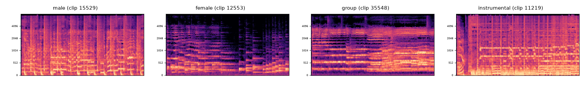

## 2. Данные

### Паспорт набора данных

| Параметр | Значение |
|---|---|
| Источник | MagnaTagATune (MTAT), Law et al., ISMIR 2009. Оригинал: https://mirg.city.ac.uk/codeapps/the-magnatagatune-dataset. Аудио взято из зеркала https://huggingface.co/datasets/confit/magnatagatune (`annotations_final.csv` и `clip_info_final.csv` побайтно совпадают с оригиналом) |
| Лицензия | CC BY-NC-SA 3.0 (музыка Magnatune), только некоммерческое использование — подходит для учебной работы и ВКР |
| Единица наблюдения | 29-секундный клип трека, mp3 16 кГц; в модели подаются первые 10 секунд |
| Исходный объём | 25 863 клипа, 188 тегов, 230 артистов |
| Классы | `male` — мужской сольный вокал; `female` — женский сольный; `group` — хор / дуэт / одновременно теги male и female; `instrumental` — без вокала |
| Правило разметки | Синонимичные теги объединены (например, `male`, `male vocal`, `man singing`, `male voice` → male; `no vocal`, `no voice`, `instrumental` → instrumental), см. `src/prepare_labels.py` |
| Пропуски | 18 662 клипа (72%) не имеют ни одного вокального тега — исключены, так как в MTAT отсутствие тега не означает отрицательную метку. 4 клипа не удалось скачать (сетевой сбой), исключены |
| Противоречия | 95 клипов имеют одновременно вокальный тег и `no vocals` — исключены |
| Дубликаты | Точных дубликатов по `mp3_path` нет; одинаковых треков (artist+album+title) в разных частях split нет. Почти-дубликаты по аудио (косинусное сходство признаков > 0,995) между частями: 3 пары, клипы удалены из val/test |
| Итоговый объём | 7 099 клипов: instrumental 34,6%, male 26,1%, female 25,0%, group 14,3% |
| Дисбаланс | max/min = 2,41 (instrumental / group) |
| Временная структура | Дат выпуска в наборе нет; клипы — последовательные сегменты одного трека (в среднем 2,1 клипа на трек), поэтому возможна утечка между соседними сегментами |

### Проверка утечки и разбиение

Главный риск утечки в MTAT — одни и те же артисты, треки и соседние сегменты одного трека. Поэтому разбиение выполнено **по артистам** (StratifiedGroupKFold, seed = 42), примерно 70/15/15:

| Split | Артистов | male | female | group | instrumental | Всего |
|---|---|---|---|---|---|---|
| train | 163 | 1 326 | 1 266 | 724 | 1 755 | 5 071 |
| val | 34 | 267 | 253 | 149 | 350 | 1 019 |
| test | 33 | 261 | 254 | 144 | 350 | 1 009 |

Пересечений артистов между train/val/test нет (проверено в `data_stats.json`). Split зафиксирован **до** запуска моделей.

**Наборы для протокола сравнения:**
- `cmp_test` — сбалансированная подвыборка test, по 50 клипов каждого класса (200 клипов). Это единый тест для сравнения всех моделей;
- `full_test` — весь test (1 009 клипов, естественный дисбаланс). На нём оценивается лучшая модель на срезе большего объёма;
- few-shot примеры — по одному фиксированному клипу каждого класса из train (clip_id 15529, 12553, 35548, 11219), одинаковые для всех моделей.

### Схема предобработки

```
annotations_final.csv ─┐
clip_info_final.csv ───┴─> prepare_labels.py: синонимы тегов -> 4 класса, удаление пустых/противоречивых,
                           split по артистам 70/15/15
                      ─> fetch_audio.py: загрузка только размеченных клипов (HTTP Range из zip)
                      ─> make_spectrograms.py: mono 22,05 кГц, первые 10 с, лог-мел 128 полос, 0–8 кГц,
                           PNG 448×224, colormap magma, подписи частот (Гц); признаки: mean/std лог-мел + MFCC-20
                      ─> build_eval_sets.py: почти-дубликаты между частями, cmp_test, few-shot примеры
```



### Ограничения разметки

1. **Слабая разметка.** Теги MTAT собраны в игре, а не экспертами; метка относится ко всему клипу, а не к первым 10 секундам. Во фрагменте вокал может ещё не начаться.
2. **Сцепление с жанром.** Доля клипов с тегом `rock` у класса male — 39% (у female — 8%); тег `opera` у group — 35%, у female — 27%. Модель может частично распознавать жанр, а не голос.
3. **Смещение каталога.** Magnatune — независимый лейбл с большой долей классики и электроники; на коммерческий поп-каталог результаты переносятся с осторожностью.
