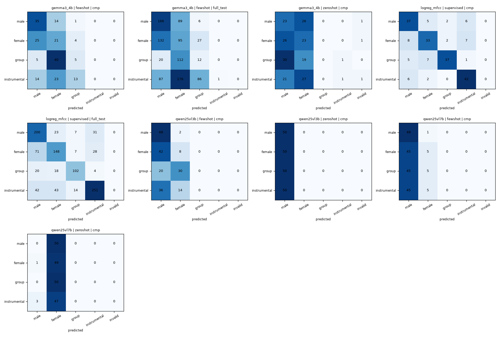

## 4. Сравнение LLM (cmp_test, 200 клипов, по 50 на класс)

Случайный уровень Macro-F1 при 4 сбалансированных классах — 0,25. Константный ответ одним классом даёт Macro-F1 = 0,10.

| Модель | Режим | Macro-F1 [95% ДИ] | F1 male | F1 female | F1 group | F1 instr. | MCC | Bal. acc | Невалидные | ECE |
|---|---|---|---|---|---|---|---|---|---|---|
| **LogReg мел/MFCC** (baseline) | supervised | **0,746** [0,684; 0,803] | 0,698 | 0,680 | 0,813 | 0,792 | 0,662 | 0,745 | 0,0% | 0,083 |
| Gemma-3-4B | few-shot | **0,241** [0,195; 0,284] | 0,543 | 0,284 | 0,137 | 0,000 | 0,083 | 0,305 | 0,0% | 0,645 |
| Gemma-3-4B | zero-shot | 0,166 [0,126; 0,208] | 0,307 | 0,317 | 0,000 | 0,038 | −0,018 | 0,235 | 1,5% | 0,712 |
| Qwen2.5-VL-3B | few-shot | 0,161 [0,127; 0,191] | 0,490 | 0,154 | 0,000 | 0,000 | 0,055 | 0,280 | 0,0% | 0,670 |
| Qwen2.5-VL-7B | few-shot | 0,143 [0,108; 0,180] | 0,419 | 0,152 | 0,000 | 0,000 | 0,060 | 0,270 | 0,0% | 0,532 |
| Qwen2.5-VL-3B | zero-shot | 0,100 [0,080; 0,120] | 0,400 | 0,000 | 0,000 | 0,000 | 0,000 | 0,250 | 0,0% | 0,700 |
| Qwen2.5-VL-7B | zero-shot | 0,100 [0,079; 0,118] | 0,000 | 0,398 | 0,000 | 0,000 | −0,029 | 0,245 | 0,0% | 0,555 |

**Распределение ответов LLM** (из 200; истинное — 50/50/50/50):

| Модель / режим | male | female | group | instrumental | invalid |
|---|---|---|---|---|---|
| Gemma-3-4B few-shot | 79 | 98 | 23 | 0 | 0 |
| Gemma-3-4B zero-shot | 100 | 95 | 0 | 2 | 3 |
| Qwen2.5-VL-3B few-shot | 146 | 54 | 0 | 0 | 0 |
| Qwen2.5-VL-7B few-shot | 184 | 16 | 0 | 0 | 0 |
| Qwen2.5-VL-3B zero-shot | 200 | 0 | 0 | 0 | 0 |
| Qwen2.5-VL-7B zero-shot | 4 | 196 | 0 | 0 | 0 |

### Анализ сравнения

1. **Формат ответа соблюдается.** Доля невалидных ответов — 0% у пяти из шести конфигураций LLM и 1,5% у Gemma zero-shot: в 3 случаях модель вопреки инструкции начала текстовое рассуждение («Based on the provided spectrogram…») и не уложилась в лимит 48 токенов до JSON. Структурированный вывод для этой задачи не является узким местом.
2. **LLM не распознают тип вокала по спектрограмме.** Все конфигурации находятся на уровне случайного угадывания или ниже (Macro-F1 ≤ 0,25, MCC ≤ 0,08). Zero-shot-модели отвечают почти константой (Qwen-3B — всегда `male`, Qwen-7B — 98% `female`). Класс `instrumental` LLM почти никогда не выбирают: гармонические полосы есть и у инструментов, а отличие вокала (изогнутые контуры с вибрато и глиссандо против ровных полос и вертикальных атак у инструментов) тонкое, и модели его не используют.
3. **Few-shot помогает всем моделям** (H2 подтверждена): +0,075 у Gemma, +0,061 у Qwen-3B, +0,043 у Qwen-7B. Но прирост достигается главным образом за счёт того, что ответы распределяются между 2–3 классами, а не за счёт содержательного распознавания.
4. **Масштаб внутри семейства не помогает:** Qwen-7B не лучше Qwen-3B (интервалы перекрываются).
5. **Уверенность не калибрована:** модели заявляют одну и ту же уверенность (0,8 у Qwen, 0,95 у Gemma) для верных и неверных ответов, ECE 0,53–0,71. Использовать её для отбора «надёжных» ответов нельзя.
6. **Обучаемый baseline на порядок сильнее:** Macro-F1 0,746 против 0,241 у лучшей LLM, интервалы далеко не перекрываются (H3 подтверждена).

### Выбор лучшей LLM

По правилу из раздела 3: фильтр «Macro-F1 > 0,40 и невалидных < 5%» не проходит ни одна LLM, поэтому применяется п. 4 правила. Лучшая LLM — **Gemma-3-4B-it в режиме few-shot**: максимальный Macro-F1 0,241, нижняя граница её интервала (0,195) выше верхней границы следующей конфигурации (Qwen-3B few-shot, 0,191). Это единственная модель, которая хотя бы иногда выбирает класс `group`, и у неё ноль невалидных ответов.
